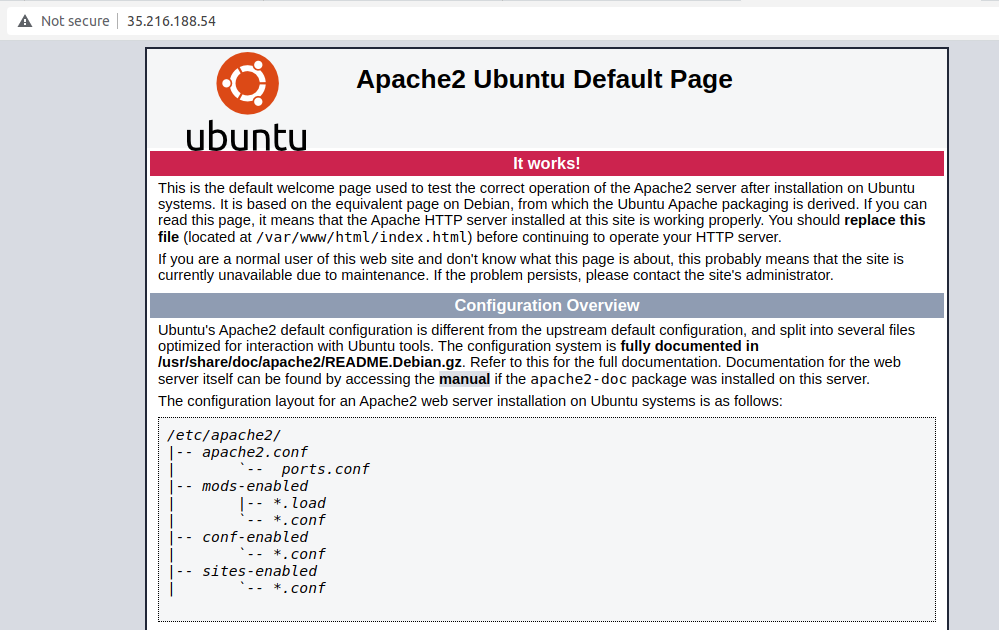

# Laboratorio: Aplicaciones cifrado

## Requisitos previos

- Máquina GNU/Linux: portátil, máquina virtual, o PC laboratorio (Entrar con credencial LDAP).
- Editor de código. En Visual Studio Code, pulsando ctrl+mayus+v renderiza este archivo de manera amigable (Sobre todo para imágenes).
- Herramientas necesarias: OpenSSL (`sudo apt install openssl`), Apache (`sudo apt-get install apache2`).
- Repositorio GitHub de asignatura: puedes subir los programas desarrollados en el laboratorio.

## Instalación de Apache

Para crear un sitio web seguro primero hay que instalar un servidor web en nuestro servidor de Google Cloud, en este caso Apache. Para hacerlo, abre una conexión SSH al servidor y ejecuta:

```bash
sudo apt-get install apache2
```

Si visitas la IP de la máquina con el navegador, por ejemplo `http://35.216.188.54`, debería aparecer la página por defecto de Apache. El navegador mostrará que la conexión no es segura, por ejemplo, mediante el mensaje “Not secure”.



## Creación de un sitio seguro

Si queremos que las conexiones al sitio web que acabamos de crear sean seguras, usando el protocolo HTTPS en vez de HTTP, debemos usar un certificado de servidor autofirmado y redirigir el tráfico del puerto 80 al puerto 443.

Para ello, en vez de usar la configuración por defecto de Apache, crea un `VirtualHost` que sólo contenga una página web llamada `index.html`, con el siguiente contenido:

```html
<h1>Conexión SSL</h1>
```

Genera un certificado autofirmado con OpenSSL y crea una configuración nueva de Apache con la redirección del puerto 80 al puerto 443.

Al visitar la web mediante HTTPS, aunque tenga un certificado, seguirá apareciendo un mensaje de error. Exporta el certificado y añádelo a tu navegador para que deje de mostrar ese aviso.

Teniendo en cuenta que inicialmente estamos en la maquina virtual, estos son los pasos a seguir:

1. Instalar Apache y Openssl
```bash
sudo apt-get update
sudo apt-get install apache2 openssl
```

2. Crear la carpeta para los certificados
```bash
sudo mkdir -p /etc/apache2/ssl
cd /etc/apache2/ssl
```

3. Crear la CA (Certificado de Autoridad)
```bash
sudo openssl req -x509 -newkey rsa:2048 -nodes -days 3650 \
-keyout ca.key \
-out ca.crt \
-subj "/C=ES/ST=Bizkaia/L=Bilbao/O=Practica/CN=Practica-CA" \
-addext "basicConstraints=critical,CA:TRUE" \
-addext "keyUsage=critical,keyCertSign,cRLSign"
```

4. Crear clave privada del servidor
```bash
sudo openssl genrsa -out seguro.key 2048
```

5. Crear la petición CSR
```bash
sudo openssl req -new \
-key seguro.key \
-out seguro.csr \
-subj "/C=ES/ST=Bizkaia/L=Bilbao/O=Practica/CN=IP_EXTERNA"
```

6. Añadir el Subject Alternative Name
```bash
sudo nano /etc/apache2/ssl/ext.cnf
```

Dentro, rellenamos la siguiente información:

subjectAltName=IP:IP_EXTERNA
basicConstraints=critical,CA:FALSE
keyUsage=critical,digitalSignature,keyEncipherment
extendedKeyUsage=serverAuth

7. La CA firma el certificado del servidor
```bash
sudo openssl x509 -req \
-in seguro.csr \
-CA ca.crt \
-CAkey ca.key \
-CAcreateserial \
-out seguro.crt \
-days 365 \
-sha256 \
-extfile ext.cnf
```

8. Proteger las claves privadas
```bash
sudo chmod 600 ca.key
sudo chmod 600 seguro.key
```

9. Crear DocumentRoot
```bash
sudo mkdir -p /var/www/seguro
sudo nano /var/www/seguro/index.html
<h1>Conexión SSL</h1> 
```

10. Crear el VirtualHost
```bash
sudo nano /etc/apache2/sites-available/seguro.conf

<VirtualHost *:80>
    ServerName IP_EXTERNA
    Redirect permanent / https://IP_EXTERNA/
</VirtualHost>

<VirtualHost *:443>
    ServerName IP_EXTERNA

    DocumentRoot /var/www/seguro

    SSLEngine on
    SSLCertificateFile /etc/apache2/ssl/seguro.crt
    SSLCertificateKeyFile /etc/apache2/ssl/seguro.key

    <Directory /var/www/seguro>
        Require all granted
    </Directory>
</VirtualHost>
```


11. Activar SSL, desactivar la página por defecto y activar nuestra página
```bash
sudo a2enmod ssl
sudo a2dissite 000-default.conf
sudo a2ensite seguro.conf
```

12. Comprobar antes de reiniciar
```bash
sudo apache2ctl configtest
sudo systemctl restart apache2
```

13. Exportar la CA al ordenador
```bash
sudo cp /etc/apache2/ssl/ca.crt ~/
sudo chown $USER:$USER ~/ca.crt
```

Ahora, desde tu ordenador:
```bash
scp TU_USUARIO_MV@IP_EXTERNA:~/ca.crt .
```

14. Importar la CA en Firefox y probar
