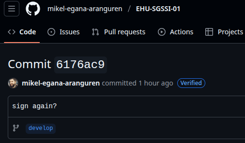

# Laboratorio: Cifrado asimétrico

## Requisitos previos

- Máquina GNU/Linux: portátil, máquina virtual, o PC laboratorio (Entrar con credencial LDAP).
- Editor de código. En Visual Studio Code, pulsando ctrl+mayus+v renderiza este archivo de manera amigable (Sobre todo para imágenes).
- Herramientas necesarias: OpenSSL (`sudo apt install openssl`), gpg (`sudo apt install gpg`).
- Repositorio GitHub de asignatura: puedes subir los programas desarrollados en el laboratorio.

## Generar claves GPG

[GnuPG (GPG)](https://gnupg.org/) es un programa libre que nos permite cifrar, descifrar y firmar información cumpliendo el estándar [OpenPGP](https://www.openpgp.org/) y así asegurar nuestras comunicaciones. GPG ofrece muchas posibilidades. Es conveniente familiarizarse con ellas:

```bash
gpg --help
```

Para trabajar con GPG, lo primero es generar un par de claves (Pública y privada):

```bash
gpg --generate-key
```

Es muy importante proveer una dirección de email válida. La frase clave es opcional y sirve para proteger el acceso al llavero de claves privadas. En PGP, el llavero es el almacén donde se almacenan las claves con las que se va a trabajar. Existe un llavero de claves privadas, y otro llavero de claves públicas. Es aconsejable proteger el llavero con una frase clave.

Usando el comando `gpg --full-generate-key` se puede especificar qué longitud de clave deseáis usar, y qué algoritmo queréis usar para su creación. GnuPG soporta RSA, DSA y ElGamal. Para la creación del par de claves se usa una medida denominada entropía, que simboliza la cantidad de aleatoriedad o desorden que tiene la clave. A mayor entropía, mayor aleatoriedad y por lo tanto más complicado de realizar un criptoanálisis. En la generación de claves la entropía se obtiene en base a datos de la máquina como el estado de la CPU, la fecha, el número de ventanas abiertas, etc. Así que mientras se genera la clave es aconsejable navegar, abrir ventanas, teclear cosas, etc. para generar una entropía lo mayor posible.

Una vez terminada la generación de las claves se da la posibilidad de crear un certificado de revocación de las claves. El certificado de revocación sirve para indicar que tu clave ya no es válida porque la has perdido, te la han robado, etc. Cread el certificado de revocación y guardadlo.

Una vez creadas las claves, para verlas:

```bash
gpg --list-keys
```

¿Qué quiere decir `[ultimate]`?

Es el nivel de confianza que GPG asigna a esa identidad (trust level), y aquí concretamente significa confianza absoluta. GPG te la asigna automáticamente a ti mismo, porque asume que confías en tus propias claves sin necesidad de verificación: son las que acabas de generar tú, en tu máquina.

Es importante que la clave pública esté accesible. Se puede publicar en una página [web personal](https://mikel-egana-aranguren.github.io/contact/), se puede enviar adjunta en un email, o se puede publicar en servidores específicos como **keys.openpgp.org** (Ver más adelante).

Para enviar archivos que han sido cifrados en la línea de comandos mediante GPG simplemente basta con adjuntarlos en el email.

- Cifrad este archivo y enviároslo entre vosotros de forma que consigáis los principios de **Confidencialidad**, **Integridad**, **Autenticidad** y **No Repudio**.

> Razonad qué habéis tenido que hacer para conseguir cada uno de ellos.

1. Crear claves
```bash
gpg --generate-key
```

2. Exportar tu clave pública a una archivo
```bash
gpg --armor --export tu_email@ejemplo.com > mi_clave_publica.asc
```
Después, le pasas ese archivo por correo o USB.

3. Importar la clave
```bash
gpg --import clave_publica_compañero.asc
```

Para asegurarse que todo ha ido bien, deberia aparecer en tus claves con el comando: gpg --list-keys

4. Darle confianza
```bash
gpg --edit-key email_del_compañero
```

Una vez aqui, pon trust y te pedira un número del 0 al 5. Despúes de asignarle el número, pon "sign" para firmarlo.

5. Cifrar y firmar un documento
```bash
gpg --output Cifrado_asimetrico.md.gpg --encrypt --sign --recipient email_del_compañero Cifrado_asimetrico.md
```

Enviar el archivo cifrado y firmado al compañero por correo o USB

6. Descifrar y verificar
```bash
gpg --decrypt Cifrado_asimetrico.md.gpg > recibido.md
```

## Confianza sobre las claves GPG

Como habéis podido comprobar, es muy fácil crear un par de claves y poner cualquier nombre. No se realiza ningún tipo de comprobación. Por lo que si recibimos un archivo firmado y/o cifrado por una persona, no podemos estar seguros de que realmente sea esa persona a no ser que tengamos alguna manera de preguntarle si esa es realmente su clave. Sin embargo, existen mecanismos para que podamos confiar en las claves de una persona aun sin necesidad de conocerla o haber hablado previamente con ella para comprobar si esa es su clave.

- En cada grupo se designará a uno de los estudiantes como “de confianza”, es decir el profesor tendrá confianza plena en esa persona. Ese estudiante enviará su clave pública al profesor. El grupo tendrá que conseguir que al enviar las claves públicas de los otros estudiantes al profesor aparezcan como de confianza (`[full]`) en el **anillo de claves del ordenador del profesor**.

> Razonad qué habéis tenido que hacer para conseguirlo.

Los pasos a seguir para realizar el ejercicio son los siguientes:

1. Exportar clave
```bash
gpg --armor -- export email_confianza@ejemplo.com > clave_confianza.asc
```
Se la enviamos al profesor por correo o USB

2. Importar clave y darle confianza
```bash
gpg --import clave_confianza.asc
gpg --edit-key email_confianza@ejempo.com
```
Dentro del modo -> trust -> 4 o 5 -> sign -> save

3. El resto de estudiantes le pasan su clave pública al estudiante de confianza. Este debe importarlas y firmarlas

```bash
gpg --import clave_confianza.asc
gpg --sign-key email_confianza@ejempo.com
```

4. El estudiante de confianza exporta la clave del compañero ya firmada
```bash
gpg --armor --export email_del_compañero@ejemplo.com > clave_firmada.asc
```

5. El profesor la importa y aparecera directamente como clave de confianza

## Anillos públicos de claves GPG

Lo más sencillo para publicar y buscar claves es usar un servicio como [Keys OpenPGP](https://keys.openpgp.org/). Para usarlo hay que añadir la siguiente linea al archivo `/home/{usuario}/.gnupg/gpg.conf`:

```bash
keyserver hkps://keys.openpgp.org
```

- Configura GPG para que funcione con **keys.openpgp.org** desde la terminal.
- Sube tu clave al servidor usando GPG en la terminal.
- Busca las claves de los otros estudiantes y la del profesor usando GPG en la terminal.
- Recrea el ejercicio de la sección anterior, **Confianza sobre las claves**, pero esta vez usa el servidor de claves a través de la terminal en vez de enviar las claves al profesor (Notifica al profesor para que busque las claves de confianza).

Los pasos a seguir para realizar el ejercicio son los siguientes:

1. Configurar el servidor
```bash
mkdir -p ~/.gnupg
echo "keyserver hkps://key.opengpg.org" >> ~/.gnupg/gpg.conf
```

2. Subir la clave pública
```bash
gpg --keyserver hkps://key.opengpg.org --send-keys TU_FINGERPRINT
```
El fingerprint se obtiene con:
```bash
gpg --fingerprint tu_email@ejemplo.com
```

3. Buscar claves de otros
```bash
gpg --keyserver hkps://keyserver.opengpg.org --search-keys email_del_compañero@ejemplo.com
```

4. Puedes importarla si pones 1 y ejecutas

## Anillo de claves GPG de la clase SGSSI

Vamos a recrear el anillo de claves de la sección anterior, pero sólo con las claves de los estudiantes de clase y usando eGela. Para ello, el profesor definirá una cadena de confianza designando a ciertos estudiantes, y el resto de estudiantes subirán sus claves públicas asegurando la confianza de manera transitiva (Empezando en los estudiantes de confianza). El profesor comprobará la confianza de la cadena importando todas las claves, pero dándole confianza sólo a la primera (Al importarlas, todas deberían aparecer como de confianza en el ordenador del profesor).

## Firmas GPG

En la página web de los desarrolladores de [Enigmail](http://www.enigmail.net/download) se pueden descargar dos ficheros, la extensión para Thunderbird (`.xpi`) y otro fichero llamado “GPG Signature”.

> ¿Para qué sirve ese segundo fichero?¿Cómo se usa?

Es una firma separada del archivo de descarga. No contiene el programa, solo una firma caluclada sobre él. Su propósito es que puedas comprobar dos cosas antes de instalar nada;
- Integridad: que el archivo no se ha corrompido ni modificado.
- Autenticidad: que lo publicó de verdad el desarrollador y no alguien suplantándolo.

En GitHub existe la opción de firmar commits mediante GPG, para aumentar la seguridad y trazabilidad de dichos commits. El profesor ha firmado el commit con el Hash `6176ac9c479797c698b153c7750fa3e4421f445d` de la rama `develop` del repositorio de apuntes de la asignatura [EHU-SGSSI-01](https://github.com/mikel-egana-aranguren/EHU-SGSSI-01), con la clave privada generada a la vez que la siguiente clave pública (`mikel.egana.aranguren@gmail.com`):

```
-----BEGIN PGP PUBLIC KEY BLOCK-----
mDMEaMlpKBYJKwYBBAHaRw8BAQdA9BUe340yfVTGvu5htYNgujz5pGtx6GfIRP8h
CALZ+im0OE1pa2VsIEVnYcOxYSBBcmFuZ3VyZW4gPG1pa2VsLmVnYW5hLmFyYW5n
dXJlbkBnbWFpbC5jb20+iJkEExYKAEEWIQQYFaxDxNCAFSKkZypj4GjUA79N7wUC
aMlpKAIbAwUJBaOagAULCQgHAgIiAgYVCgkICwIEFgIDAQIeBwIXgAAKCRBj4GjU
A79N75+fAQD75ya26vOiPsP18zWcclNbEqbt4f/260ycrRYsAoeNAgD/Wsa8GlSP
DnG2X1SC2GY8/X0rfcavzE3Ib4gJzoOkSQe4OARoyWkoEgorBgEEAZdVAQUBAQdA
4zlL3S3rbtPiUuPBscGteaVhYCRjmVuph+0KE/FUQUoDAQgHiH4EGBYKACYWIQQY
FaxDxNCAFSKkZypj4GjUA79N7wUCaMlpKAIbDAUJBaOagAAKCRBj4GjUA79N71q2
AP0W791v7y2QBsaxNuWlZqW/CNHamHJz1hr7tCWs/Jfa2wD9Gh1rszwCy6zXCNOv
hqLrPTy2euh/O45VyZSigvW+QgM=
=aYb8
-----END PGP PUBLIC KEY BLOCK-----
```

El commit aparece como verificado en GitHub (“Verified”). ¿Esto qué quiere decir?

Eso significa que GitHub ha hecho, en sus propios servidores, la misma comprobación que tú acabas de hacer localmente: ha comprobado la firma GPG del commit contra una clave pública que el autor subió previamente a su perfil de GitHub. Si la firma es válida y coincide con una clave asociada a la cuenta que aparece como autora, marca el commit como "Verified".



> Verifica ese mismo commit en tu ordenador local. ¿Qué pasos tienes que seguir?

1. Importar la clave pública del profesor:
```bash
gpg --import profesor.asc
```

2. Situarse en la rama correcta:
```bash
cd EHU_SGSSI_01
git chekcout develop
```

3. Verificar el commit concreto:
```bash
git verify-commit 6176ac9c479797c698b153c7750fa3e4421f445d
```

> Usa tus claves GPG para firmar un commit en el repositorio GitHub de la asignatura, de modo que aparezca como “Verified” al verlo en GitHub. Verifica los commits firmados por otros estudiantes.

1. Exportar y subir la clave pública a GitHub.
```bash
gpg --armor --export email@ejemplo.com > mi_clave_publica.asc
```
Copia la salida con un 'cat' y pegala en GitHub: Settings -> SSH and GPG keys -> New GPG keys. Ambos maild (GPG y GitHub) deben coincidir.

2. Decirle a Git que clave usar
```bash
git config --global user.signingkey TU_FINGERPRINT
git config --global commit.gpgsign true
```

3. Hacer y subir el commit
```bash
git commit -m "mi commit firmado"
git push
```

Para verificar commits de compañeros:
```bash
gpg --keyserver hkps://keys.openpgp.org --recv-keys FINGERPRINT_DEL_COMPAÑERO
git verify-commit HASH_DEL_COMMIT
```

## Otras funcionalidades GPG

Es importante que seáis capaces de usar vuestras claves en otros equipos, sobre todo de cara al examen.

> ¿Cómo se exporta una clave GPG para poder usarla en otro equipo?

Para exportar las claves privadas y públicas:

```bash
gpg --armor --export-secret-keys tu_email@ejemplo.com > clave_privada.asc
gpg --armor --export tu_email@ejemplo.com > clave_publica.asc
gpg --export-ownertrust > confianza.txt
```

Para importarlas en el ordenador:

```bash
gpg --import clave_publica.asc
gpg --import clave_privada.asc
gpg --import-ownertrust confianza.txt
```

Puede pasar que una clave quede comprometida.

> ¿Cómo revocarías tu clave?

Si ya generaste un certificado de revocación al generar la clave, entonces:
```bash
gpg --import revocacion.asc
```

Para generar el certificado de revocación: 
```bash
gpg --gen-revoke tu@email.com > revocacion.asc
```

Si la hubieses subido a un servidor, valdría con resubirla.
```bash
gpg --keyserver hkps://keys.openpgp.org --send-keys TU_FINGERPRINT
```

Aunque su función principal es el cifrado asimétrico, GPG también se puede usar para cifrado simétrico.

> ¿Como cifrarías este documento de manera simétrica, y qué pasos seguirías para que el receptor lo descifre?

```bash
gpg --symmetric --cipher-algo AES256 Cifrado_asimetrico.md
```

En vez de una clave pública, te pedira una contraseña y cifrara con ella. Es importante luego pasarsela al receptor para que pueda descifrar la contraseña.

```bash
gpg --decrypt Cifrado_asimetrico.md.gpg > recibido.md
```

## RSA

Genera un par de claves RSA con OpenSSL:

```bash
openssl genpkey -algorithm RSA -out clave.pem
```
El archivo `clave.pem` tiene ambas claves, para poder ver su estructura interna: 

```bash
openssl rsa -text -in clave.pem
```

Para extraer la clave pública:

```bash
openssl rsa -pubout -in clave.pem -out clave_publica.pem
```

Encripta un mensaje con la clave publica mediante `openssl pkeyutl -encrypt`. Descífralo con la clave privada y comprueba que el mensaje coincide. 

1. Crear mensaje corto:
```bash
echo "Mensaje secreto RSA" > mensaje_rsa.txt
```

2. Cifrar con clave pública:
```bash
openssl pkeyutl -encrypt -inkey clave_publica.pem -pubin -in mensaje_rsa.txt -out mensaje_rsa.enc
```

3. Descifrar con clave privada
```bash
openssl pkeyutl -decrypt -inkey clave.pem -in mensaje_rsa.enc -out mensaje_rsa.dec
```

4. Comprobar que coinciden:
```bash
cmp mensaje_rsa.txt mensaje_rsa.dec
diff mensaje_rsa.txt mensaje_rsa.dec
```
Si no imprime nada, son idénticos.

> RSA sirve para archivos pequeños. ¿Cómo implementarías un cifrado híbrido, usando AES para cifrar el archivo de manera simétrica y RSA para cifrar la clave AES? 

Para ello, utilizaría OpenSSL y seguriría los siguientes pasos:

1. Generar una clave AES aleatoria de un solo uso: openssl rand -out clave_aes.bin 32

2. Cofrar el archivo grande con esa clave AES: openssl enc -aes-256-cbc -salt -in archivo_grande.txt -out archivo_grande.enc -pass file:clave_aes.bin

3. Cifrar la clave AES (pequeña) con la clave pública RSA del destinatario: openssl pkeyutl -encrypt -inkey clave_publica.pem -pubin -in clave_aes.bin -out clave_aes.enc

4. Enviar al destinatario dos archivos: archivo_grande.enc (el contenido, cifrado con AES) y clave_aes.enc (la clave AES, cifrada con RSA). Solo quien tenga la clave privada RSA correspondiente puede recuperar la clave AES, y solo con esa clave AES se puede descifrar el archivo.

5. El destinatario, para recuperar el archivo: openssl pkeyutl -decrypt -inkey clave.pem -in clave_aes.enc -out clave_aes_recuperada.bin ; openssl enc -d -aes-256-cbc -in archivo_grande.enc -out archivo_grande.dec -pass file:clave_aes_recuperada.bin

