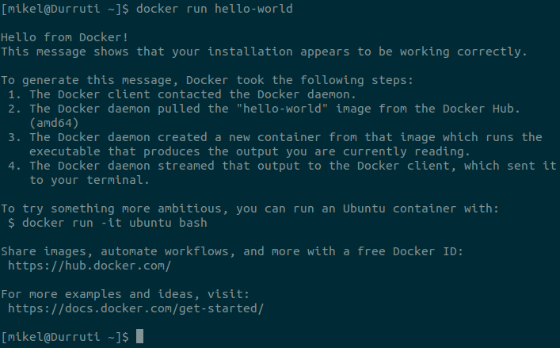
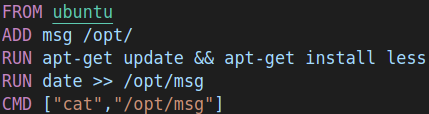
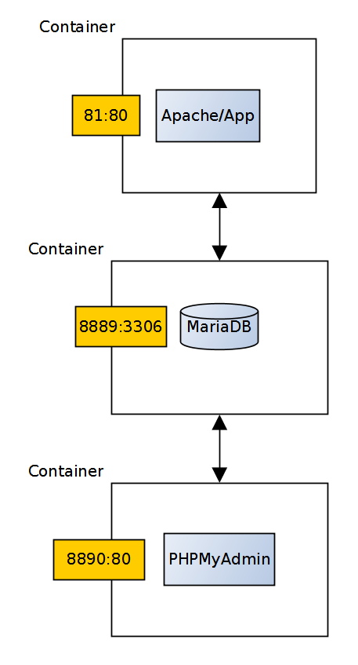
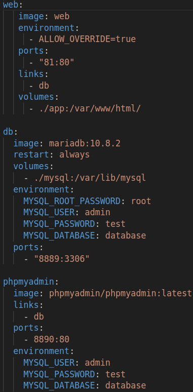
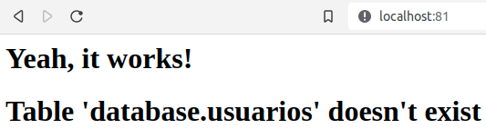
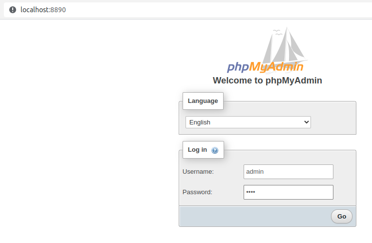
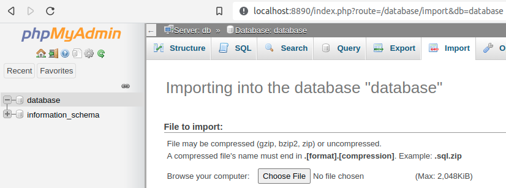
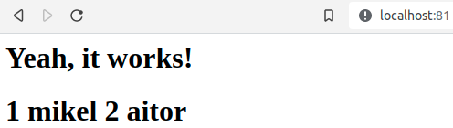

# Laboratorio: Docker

## Requisitos previos

- Editor de código. En Visual Studio Code, pulsando ctrl+mayus+v renderiza este archivo de manera amigable (Sobre todo para imágenes).
- Máquina GNU/Linux: portátil, máquina virtual, o PC laboratorio (Entrar con credencial LDAP).
- Archivos Docker.
- Proyecto básico docker-compose disponible en GitHub.

## 1. Introduccion

[Docker](https://www.docker.com/) es una infraestructura de virtualización para GNU/Linux basada en contenedores. A diferencia de otras herramientas de virtualización como VirtualBox, el motor de Docker provee una capa intermedia entre los contenedores y el sistema operativo, de modo que no hay que virtualizar el sistema operativo “entero”, haciendo los contenedores mucho más ligeros. Es una herramienta muy popular que se usa para hacer despliegues de servicios fieles al entorno original, evitando asi el famoso "En mi local funciona" (pero en el de tu cliente no).

El elemento principal de Docker es la imagen: un archivo comprimido inmutable que contiene todo lo que necesita el servicio para funcionar (sistema, binarios, librerías, archivos, etc.). A partir de una imagen se pueden crear contenedores, que son ejecuciones aisladas, efímeras y mutables del servicio.

Docker tambien ofrece la posibilidad de crear repositorios de imagenes: el repositorio oficial contiene imagenes oficiales que se pueden reusar para construir servicios específicos.

## 2. Instalacion y configuracion
Antes de cualquier instalación, recordar:

```bash
sudo apt update
```

Para instalar Docker:

```bash
sudo apt install docker.io
```

Docker necesita privilegios de `root`. Para evitar el uso de `sudo`:

- Crear grupo docker:

```bash
sudo groupadd docker
```

- Añadir usuario actual al grupo `docker`:

```bash
sudo usermod -aG docker $USER
```

- Reiniciar el sistema, volver a entrar, y ejecutar:

```bash
docker run hello-world
```




## 3. Gestionar imagenes

Docker tiene un repositorio local que contiene las imagenes que vamos a usar en nuestro ordenador.

- Puedes ver las imagenes disponibles en tu repositorio local mediante:

```bash
docker images
```

El repositorio remoto más común se encuentra en Docker Hub, que es el repositorio configurado por defecto al instalar Docker.

- Explora las imagenes que se pueden encontrar en Docker Hub.

Vamos a descargar una imagen del repositorio remoto al repositorio local:

- Busca la imagen `hello-world` en Docker Hub.
- Descarga la imagen al repositorio local:

```bash
docker pull hello-world
```

Pregunta:

- ¿Con qué comando se suben imagenes a Docker Hub desde nuestro repositorio local?

Con docker push. Pero para ello, necesitaras dos cosas precias:
1. docker login: te identificas con tu cuenta DOcker Hub
2. docker tag imagen usuario/imagen:1.0: con tag renombras la imagen con el formato usuario/nombre:etiqueta. Docker Hub neceesita saber a qué cuenta pertenece.

## 4. Ejecutar containers

En Docker, los containers se ejecutan a partir de una imagen.

- Ejecuta un container a partir de la imagen `hello-world`:

```bash
docker run hello-world
```

Pregunta:

- ¿Qué output nos da la ejecución del container?

Un mensaje que empieza por "Hello from Docker!" y que explica los pasos que ha seguido Docker (cliente contacta con el daemon, descarga de la imagen, creación del contenedor, salida por la terminal): Esta vez, no vemos Pulling from library/hello-world porque anteriormente ya descargamos la imagen. Después el contenedor termina solo, proque su único trabajo era imprimir ese texto.

- Ejecuta:

```bash
docker run -it ubuntu bash
```

Preguntas:

- ¿De dónde sale la imagen `ubuntu`?

De Docker Hub. Como no estaba en mi repositorio local, Docker la ha descargado automáticamente del repositorio remoto por defecto. Es una imagen oficial y "latest" es la etiqueta por defecto cuando no indicas version.
- ¿Qué diferencia hay entre `docker run` y `docker run -it`?

Las opciones son dos: -i mantiene la entrada estandar abierta para que pueda escribir, y -t asigna una pseudo-terminal para que la shell se comporte como una terminal normal. Sin ellas, el contenedor arranca, ejecuta bash, no recibe nada por la entrada y termina al instante. Con ellas, te quedas dentro y puedes interactuar.
- ¿Por qué ha cambiado el prompt de la terminal?

Porque ya no estás en tu máquina, sino dentro del contenedor. El promt ahora es root@a1b2c3d4e5f6:/#: soy root dentro del conteendor y el nombre de la maquina es el identificador corto del contenedor.
- Si hacemos un listado mediante `ls`, ¿A qué maquina pertenecen los directorios?

Al contenedor, Al ejecutar ls vemos sitemas de archivos de Ubuntu, no los de nmi host. Mi carpeta personal no aparece porque el contenedor tiene su propio sistema de archivos aislado.
- ¿Qué output nos da el comando `docker ps -a`?

Muestra todos los contenedores. Entre ellos destacables como hello-world o ubuntu. Sin esa -a se mostrarían solo los contenedores que estan corriendo.

Para parar los contenedores, necesitamos su nombre o identificador:

```bash
docker kill nombre_o_id
docker ps -a
```

Aunque los contenedores no están funcionando, hay que eliminarlos:

```bash
docker rm nombre_o_id
docker ps -a
docker images
```

Preguntas:

- ¿Qué diferencia hay entre parar y borrar un contenedor?

Parar detiene el proceso, pero el contenedor sigue existiendo y se pueded reiniciar. Borrar elimina el contenedor por completo, incluidos los cambios hechos dentro de él.
- ¿Cómo afecta a la imagen de la que ha surgido el contenedor?

No le afecta en absoluto. La imagen es inmutable y es independiente a sus contenedores. Puedes crear y destruir mil contenedores y la imagen sigue igual.
- ¿Cómo se borra una imagen?

Con docker rm nombre_o_id- Solo se puede borrar si no hay contenedores que dependan de ella; si los hay, primero hay que eliminar esos contenedores.

Vuelve a ejecutar un contenedor desde la imagen `ubuntu`:

```bash
docker run -it ubuntu bash
```

En otra terminal:

```bash
docker exec nombre_container ls
```

Pregunta:

- ¿Qué diferencia hay entre `run` y `exec`?
Con docker run se crea un contenedor nuevo a partir de una eimagen y ejecuta un comando en él; mientras que con docker exec se ejecuta un comando en un contenedor que ya existe y está en marcha. No crea nada nuevo. 

## 5. Construir imagenes

Para construir una imagen Docker necesitamos un Dockerfile. Un Dockerfile es un archivo de texto plano que le dice a Docker como tiene que construir la imagen.

Por ejemplo:

- `FROM`: la imagen base a usar.
- `ADD`: añade archivos locales a la imagen.
- `RUN`: ejecuta comandos.
- `CMD`: el comando que se ejecutará al arrancar el contenedor a partir de la imagen descrita en el Dockerfile.



Pregunta:

- Cuando ejecutemos un contenedor a partir de esta imagen, ¿Qué output vamos a obtener? ¿Por qué?

Veremos el contenido original del archivo msg seguido de una línea con la fecha y hora en que se construyo la imagen.

Run date >> /opt/msg se ejecuta una sola vez, durante el docker build, y su resultado queda guardado en la imagen. El CMD solo hace cat de un archivo que ya contiene esa fecha. Por eso, si lanzas el contenedor hoy, mañana o dentro de un mes, la fecha será siempre la misma: la de momento de la construcción, no la de la ejecución. 

Vamos a construir una imagen a partir del [Dockerfile de este repositorio](Dockerfile):

- Ejecuta en el mismo directorio (El nombre puede ser cualquiera):

```bash
docker build -t="nombre" .
```

- Comprueba que la imagen ha sido construida y añadida al repositorio local:

```bash
docker images
```

- Ejecuta un contenedor de la imagen que acabamos de construir:

```bash
docker run nombre
```

Preguntas:

- ¿Qué output nos da al ejecutar el contenedor?

Wed Sep 23 18:09:14 UTC 2026
- ¿Cómo cambiarías el mensaje que se obtiene?

Hay dos fromas:
1. Cambiar el texto del mensaje: editar el archivo msg en mi máquina
2. Cambiar el comportamiento: editar el DOckerfile (por ejemplo, el CMD a ["echo","otro mensaje"]).

En ambos casos hay que reconstruir la imagen para que el cambio surta efecto. Esto es así porque el ADD copia el archivo en el momento de la construcción. Si cambias msg en la maquina pero no reconstruys, la imagen sigue teniendo la copia antigua. Al reconstruir, la fecha también se actualzará, proque el "RUN data" se vuelve a ejecutar.

Docker nos permite montar directorios que son compartidos por el host y el contenedor, es decir que ambos pueden leer y escribir en esos directorios.

Para probarlo:

- Crea un directorio llamado `dir-msg` que contenga un archivo `msg2` con la cadena "iep":

```bash
mkdir dir-msg && echo "iep" > dir-msg/msg2
```

- Ejecuta un contenedor a partir de la imagen `ubuntu`, de manera interactiva, montando el directorio `dir-msg` dentro del contenedor en el directorio `/app`:

```bash
docker run -it -v "$(pwd)"/dir-msg:/app ubuntu bash
```

- Una vez dentro del contenedor, asegúrate de que se ha montado correctamente:

```bash
cat /app/msg2
```

- En otra terminal, cambia el contenido de `dir-msg/msg2` y vuelve a ejecutar `cat /app/msg2` dentro del contenedor.

Preguntas:

- ¿Ha cambiado el contenido del archivo?
- ¿Por qué?

Los contenedores son, por definición, efímeros. Por lo tanto, los volúmenes en Docker son muy importantes ya que nos permiten persistir datos que de otra manera se perderían al borrar el contenedor (Como lágrimas en la lluvia).

A la hora de desarrollar aplicaciones que se van a desplegar mediante Docker es muy común trabajar de la siguiente manera:

1. Montar directorio de desarrollo con la aplicación y el directorio con los datos en el contenedor.
2. Desarrollar y hacer pruebas.
3. Cuando obtengamos una versión estable de la aplicación, añadirla al Dockerfile.

## 6. Ejecutar servicios

Mediante docker-compose podemos definir un grupo de servicios que se ejecuten a la vez de manera coordinada, basándose cada servicio en una imagen Docker. Teniendo en cuenta que hoy en dia muchas aplicaciones se basan en combinaciones de servicios (base de datos, servidor web, otros servidores, etc.), ésta es una característica muy importante.

Vamos a ver cómo funciona docker-compose explorando un [proyecto ya existente](https://github.com/mikel-egana-aranguren/docker-lamp). El proyecto consta de tres servicios que conforman una aplicación web muy sencilla:

- Un servidor web con una aplicación PHP (la aplicación web propiamente dicha) que accede a una base de datos MariaDB.
- La base de datos MariaDB.
- Un servidor web con la aplicación PHPMyAdmin para gestionar la base de datos MariaDB.

Clona el repositorio de GitHub que contiene el proyecto:

```bash
git clone https://github.com/mikel-egana-aranguren/docker-lamp.git
```

El archivo `docker-lamp/docker-compose.yml` contiene la definición de los servicios. En este caso hay tres servicios (el nombre del servicio y de la imagen Docker en la que se basa pueden ser diferentes):

- `web`: este servicio se basa en la imagen web construida a partir del Dockerfile, que contiene un servidor web Apache y una aplicacion PHP definida en `/app` (esta imagen es una extensión de la imagen oficial de PHP). Se enlaza al servicio `db` y redirige el puerto 81 del host al puerto 80 del container (donde se ejecuta Apache).
- `db`: la imagen `mariadb` es la imagen oficial que provee la base de datos MariaDB. En este caso el servicio se ejecuta obteniendo los datos del volumen `./mysql` (es decir, si volvemos a ejecutar un container, los datos se cargarán de ese directorio y no se perderán, aunque el container haya desaparecido), con la configuración de la sección environment y redirigiendo el puerto 8889 del host al puerto 3306 del container.
- `phpmyadmin`: este servicio se basa en la imagen oficial de PHPMyAdmin, que se conecta al servicio `db` y se usa para administrar la base de datos, redirigiendo el puerto 8890 del host al puerto 80 del container.




Para desplegar el proyecto:

- Sitúa la terminal dentro del repositorio `docker-lamp`.
- Construye la imagen `web`:

```bash
docker build -t="web" .
```

- Despliega los servicios mediante:

```bash
docker-compose up
```

- Visita la web en http://localhost:81
- Para añadir los datos necesarios, visita http://localhost:8890/ (tal y como lo hemos definido en `docker-compose.yml`, usuario "admin", password "test").
- Pincha en `database` y luego en `import`, desde donde eliges el archivo `docker-lamp/database.sql`.
- Vuelve a http://localhost:81, debería tener más información.






Para parar los servicios `ctrl+c` o abrir otra terminal en el mismo directorio y:

```bash
docker-compose down
```


